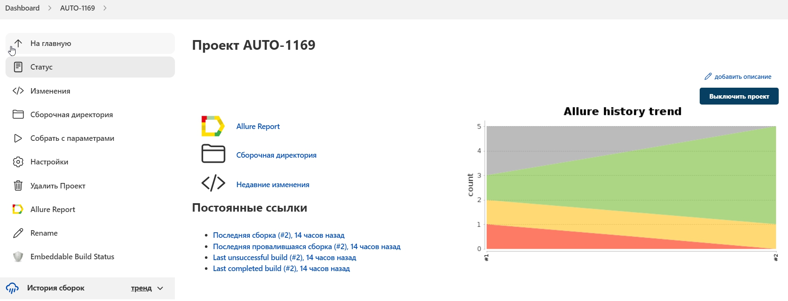
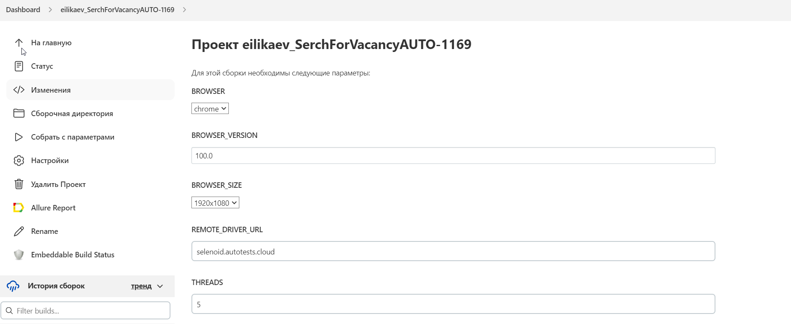
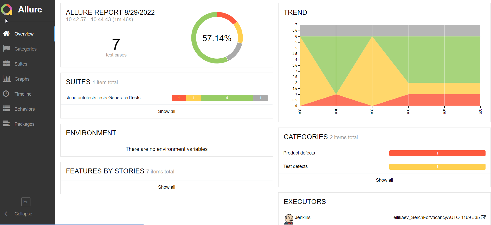
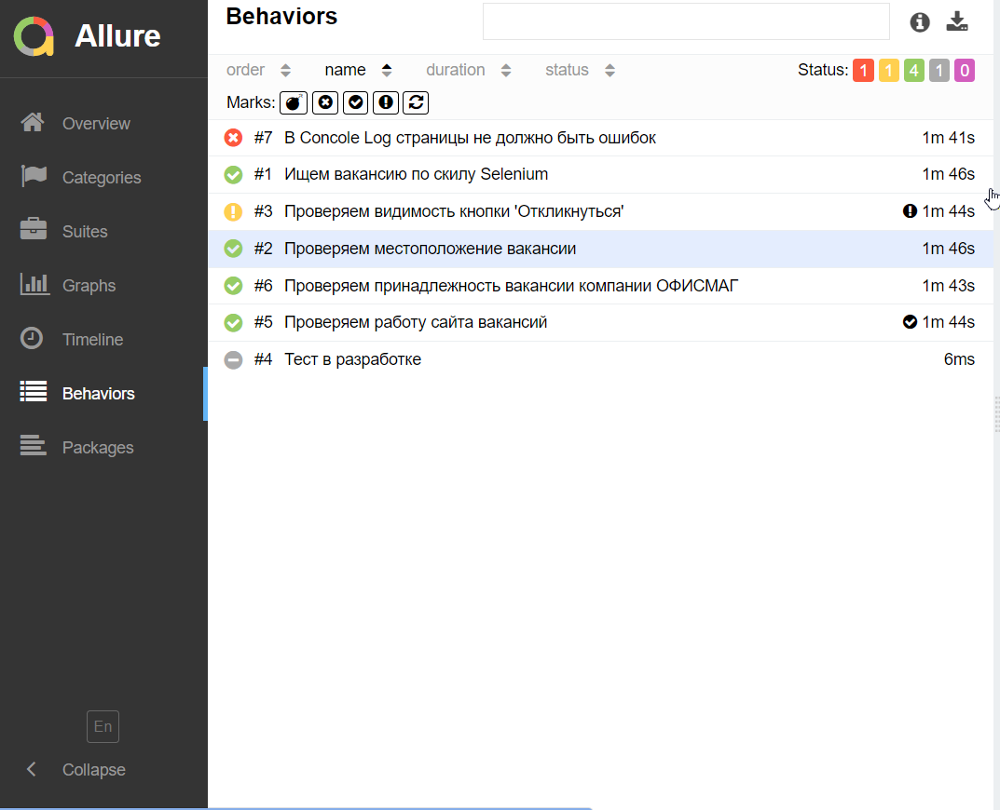
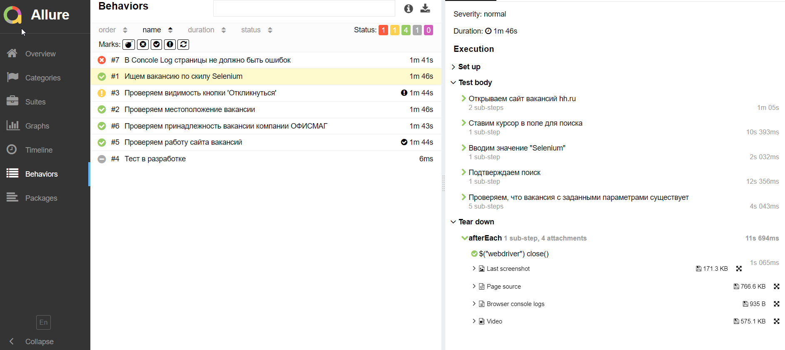
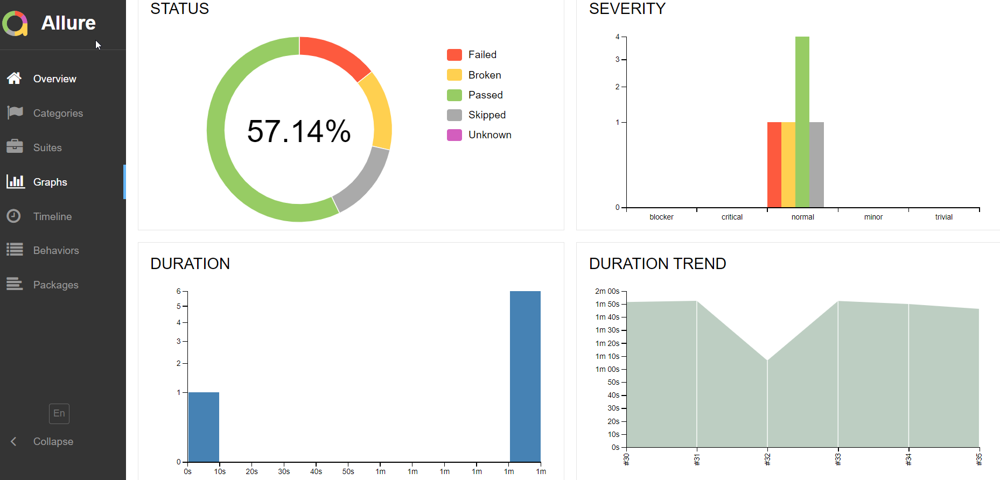
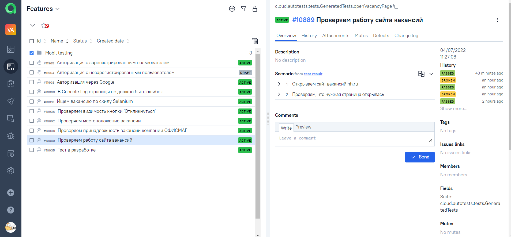
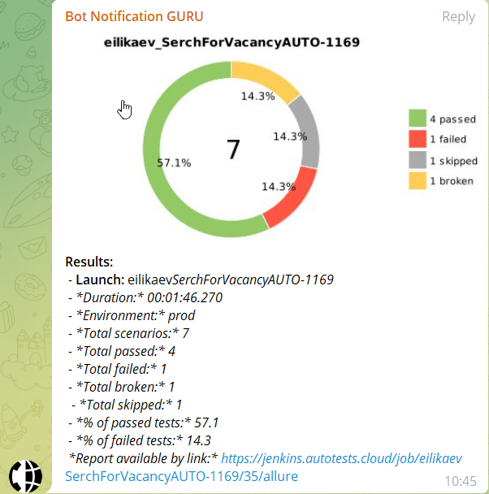
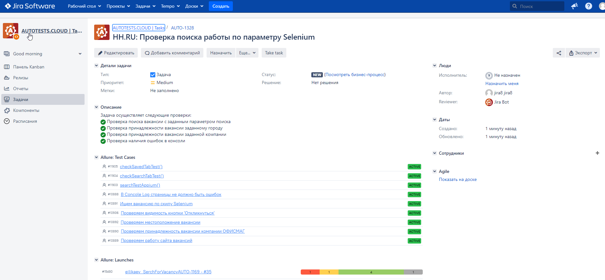

# Автоматизация тестирования на примере поиска работы на hh.ru 

# <a name="Содержание">Содержание:</a>
+ [Используемые технологии](#ИспользуемыеТехнологии) 
+ [Реализация проверок](#РеализацияПроверок)
+ [Запуск тестов локально](#ЗапускТестовЛокально)
+ [Запуск тестов из Jenkins](#ЗапускТестовИзJenkins)
+ [Сборка в Jenkins](#СборкаВJenkins)
+ [Запуск задачи в Jenkins с параметрами](#ЗапускЗадачиВJenkinsСПараметрами)
+ [Отчет о результатах прохождения тестов в Allure Report](#ОтчетОРезультатахПрохожденияТестовВAllureReport)
+ [Allure TestOps отчет](#AllureTestOpsОтчет)
+ [Оповещение в Telegram](#ОповещениеВTelegram)
+ [Интеграция с Jira](#ИнтеграцияСJira)
+ [Видео о прохождении тестов](#ВидеоОПрохожденииТестов)

# <a name="ИспользуемыеТехнологии">Используемые технологии</a>

<p align="center">


</p>

# <a name="РеализацияПроверок">Реализация проверок</a>

> Проверка поиска вакансии с заданным параметром поиска
> 
> Проверка принадлежности вакансии заданному городу
> 
> Проверка принадлежности вакансии заданной компании
> 
> Проверка наличия ошибок в консоли
> 


# <a name="ЗапускТестовЛокально">Запуск тестов локально</a>

```bash
gradle clean test
```

# <a name="ЗапускТестовИзJenkins">Запуск тестов из Jenkins</a>

```bash
clean
test
-Dbrowser=${BROWSER}
-DbrowserVersion=${BROWSER_VERSION}
-DbrowserSize=${BROWSER_SIZE}
-DbrowserMobileView="${BROWSER_MOBILE}"
-DremoteDriverUrl=https://user1:1234@${REMOTE_DRIVER_URL}/wd/hub/
-DvideoStorage=https://${REMOTE_DRIVER_URL}/video/
-Dthreads=${THREADS}
```

# <a name="СборкаВJenkins">Сборка в Jenkins</a>

<p align="center">
  
</p>


# <a name="ЗапускЗадачиВJenkinsСПараметрами">Запуск задачи в Jenkins с параметрами</a>


<p align="center">
  
</p>

# <a name="ОтчетОРезультатахПрохожденияТестовВAllureReport">Отчет о результатах прохождения тестов в Allure Report</a>


Общее представление о прохождении тестов с дэшбордами и виджетами: 

<p align="center">
  
</p>

Тест кейсы в Allure Report:

<p align="center">
  
</p>

#### Тестовые артефакты:

> - Набор тест кейсов
> - Screenshot
> - Page Source
> - Video

<p align="center">
  
</p>


<p align="center">
  
</p>


# <a name="AllureTestOpsОтчет">Allure TestOps отчет</a>

Тест кейсы в Allure TestOps:

<p align="center">
  
</p>

# <a name="ОповещениеВTelegram">Оповещение в Telegram</a>

Отправка уведомлений о результатах прохождения тестов осуществляется с помощью Telegram бота.

<p align="center">
  
</p>

# <a name="ИнтеграцияСJira">Интеграция с Jira</a>
Интеграция с Jira позволяет отследить результаты прохождения тестов.

<p align="center">
  
</p>

# <a name="ВидеоОПрохожденииТестов">Видео о прохождении тестов</a>

<p align="center">

</p>