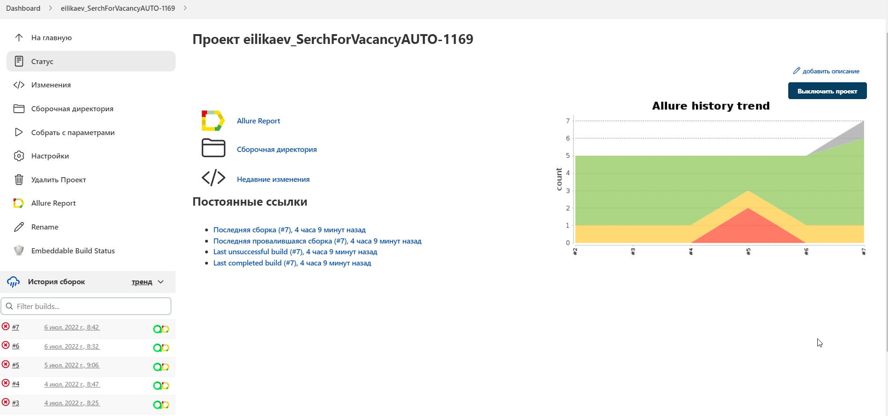

https://user-images.githubusercontent.com/87646825/177313781-329bd71d-7b2d-44c3-9f91-55c5a623999b.mp4

# Проект автоматизированного поиска вакансии на hh.ru
## :bookmark_tabs: Основной контент: 
> :radio_button: [***Используемые технологии***](#computer-mag_right-используемые-технологии)
> 
> :radio_button: [***Реализация проверок***](#ballot_box_with_check-реализация-проверок)
> 
> :radio_button: [***Команда запуска тестов локально в IntelliJ в терминале***](#arrow_forward-команда-запуска-тестов-локально-в-IntelliJ-в-терминале)
> 
> :radio_button: [***Команда запуска тестов удаленно в Jenkins***](#repeat_one-команда-запуска-тестов-удаленно-в-Jenkins) 
> 
> :radio_button: [***Сборка в Jenkins***](#package-сборка-в-jenkins)
> 
> :radio_button: [***Запуск с параметрами в Jenkins***](#label-запуск-с-параметрами-в-jenkins)
> 
> :radio_button: [***Allure отчет***](#bar_chart-allure-отчет)
> 
> :radio_button: [***Allure TestOps отчет***](#chart_with_upwards_trend-allure-testOps-отчет)
> 
> :radio_button: [***Отчет о прохождении тестов в Telegram***](#envelope-отчет-о-прохождении-тестов-в-telegram)
> 
> :radio_button: [***Интеграция Allure TestOps с Ticket Tracking Tool Jira***](#link-интеграция-allure-testOps-с-ticket-tracking-tool-jira)
> 
> :radio_button: [***Видео прохождения тестов***](#clapper-видео-прохождения-тестов)
> 

## :computer: :mag_right: _Используемые технологии_
<p align="center">


</p>

## :ballot_box_with_check: _Реализация проверок_
### :bulb: Проверка перехода на заданную страницу
### :bulb: Проверка нахождение вакансии с нужным именем 
### :bulb: Проверка принадлежности вакансии заданному городу
### :bulb: Проверка принадлежности вакансии заданной компании
### :bulb: Проверка наличия ошибок в консоли

## :arrow_forward: _Команда запуска тестов локально в IntelliJ в терминале_

```bash
gradle clean test
```

## :repeat_one: _Команда запуска тестов удаленно в Jenkins_

> _Для Запуска тестов удаленным путем используется настраиваемые параметры в Jenkins:_  

```bash
clean
test
-Dbrowser=${BROWSER}
-DbrowserVersion=${BROWSER_VERSION}
-DbrowserSize=${BROWSER_SIZE}
-DbrowserMobileView="${BROWSER_MOBILE}"
-DremoteDriverUrl=https://user1:1234@${REMOTE_DRIVER_URL}/wd/hub/
-DvideoStorage=https://${REMOTE_DRIVER_URL}/video/
-Dthreads=${THREADS}
```
## :package: _Сборка в Jenkins_

<p align="center">
  
</p>

## :label: _Запуск с параметрами в Jenkins_

<p align="center">
  
</p>

## :bar_chart: _Allure отчет_

#### Тест кейсы в Allure Report:

<p align="center">
  
</p>

#### Тест кейсы, включая результаты прохождения: Screen, Video:

<p align="center">
  
</p>

#### Графики прохождения тестов:

<p align="center">
  
</p>

## :chart_with_upwards_trend: _Allure TestOps отчет_

#### Тест кейсы в Allure TestOps:

<p align="center">
  
</p>

## :envelope: _Отчет о прохождении тестов в Telegram_
> _С помощью созданного бота в Телеграм приходят уведомления о результатах прохождения тестов_

<p align="center">
  
</p>

## :link: _Интеграция Allure TestOps с Ticket Tracking Tool Jira_
> _Благодаря интеграции Allure TestOps с Jira Cloud тестовые случаи и отчет о прохожденни тестов из Allure TestOps можно отобразить в Jira Cloud._
<p align="center">
  
</p>

## :clapper: _Видео прохождения тестов_

<div><video controls src="images/VideoResults.mp4" muted="false"></video></div>
